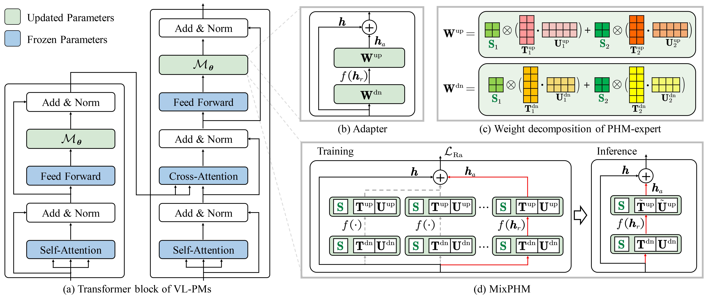

# MixPHM: Redundancy-Aware Parameter-Efficient Tuning for Low-Resource Visual Question Answering

## Overview

PyTorch implementation of [MixPHM: Redundancy-Aware Parameter-Efficient Tuning for Low-Resource Visual Question Answering](https://arxiv.org/pdf/2303.01239.pdf) (CVPR 2023).



---
This repository is based on [VL-T5](https://github.com/j-min/VL-T5), the implementation on [X-VLM](https://github.com/zengyan-97/X-VLM) can be found [here](). 


## Installation

We adopt PyTorch 1.10.0 and transformers 4.15.0. See [requirements.txt](requirements.txt) for other requirements.

```shell
pip install -r requirements.txt
```

## Datasets

Please see [data/README.md](data/README.md) to prepare datasets.

```angular2html
├── data
│   ├── annotation
│   │   ├── answer_list.json
│   │   ├── gqa
│   │   │   ├── testdev.json
│   │   │   ├── train.json
│   │   │   ├── trainval_ans2label.json
│   │   │   ├── trainval_label2ans.json
│   │   │   └── valid.json
│   │   ├── lxmert_split
│   │   │   ├── minival.json
│   │   │   ├── nominival.json
│   │   │   ├── test.json
│   │   │   ├── train.json
│   │   │   └── val.json
│   │   ├── okvqa
│   │   │   ├── mscoco_train2014_annotations.json
│   │   │   ├── mscoco_val2014_annotations.json
│   │   │   ├── train.json
│   │   │   ├── trainval_ans2label.json
│   │   │   ├── trainval_label2ans.json
│   │   │   └── val.json
│   │   └── vqav2
│   │       ├── trainval_ans2label.json
│   │       ├── trainval_label2ans.json
│   │       ├── v2_mscoco_train2014_annotations.json
│   │       ├── v2_mscoco_val2014_annotations.json
│   │       └── val.json
│   ├── coco_imgfeat
│   │       ├── train_obj36.h5
│   │       └── val_obj36.h5
│   └── vg_imgfeat
│   │       ├── vg_gqa_obj36.h5
│   │       └── gqa_testdev_obj36.h5
```

## Parameter-efficient tuning and evaluation

- Experiments on OK-VQA dataset.
```shell
bash scripts/okvqa_vlt5_mixphm.sh $GPU_IDS $num_GPU
```
- Experiments on VQA v2 dataset.
```shell
bash scripts/vqav2_vlt5_mixphm.sh $GPU_IDS $num_GPU
```
- Experiments on GQA dataset.
```shell
bash scripts/gqa_vlt5_mixphm.sh $GPU_IDS $num_GPU
```


## Acknowledgement

We acknowledge the use of the following public code in this project: [VL-T5](https://github.com/j-min/VL-T5), [Adapters](https://github.com/Adapter-Hub/adapter-transformers), [compacter](https://github.com/rabeehk/compacter), [LoRA](https://github.com/microsoft/LoRA), [AdaMix](https://github.com/microsoft/AdaMix).
